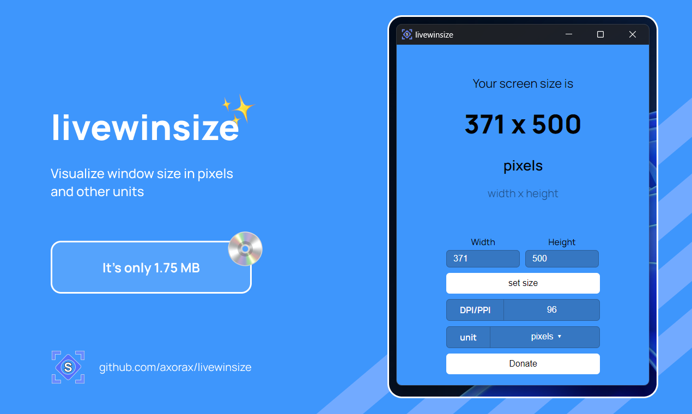

<strong><code>livewinsize</code></strong>

View window size on Desktop

# About

When you are developing Desktop applications, you may need to put the height and width of the window for when the app starts or set it to another value for any reason. You need to guess the size or put any value then test it and repeat that process. livewinsize is a simple app that shows the window size that it is currently opened in. You can use this to resize the window and get an idea on what the value for the width and height should be on your app! You can also convert the size into inches, centimeters, etc. with livewinsize and also input a custom size after which livewinsize will resize itself to that size.

# Preview

---

<a href="https://www.patreon.com/axorax">Support me on Patreon</a> — <a href="https://github.com/axorax/socials">Check out my socials</a>

